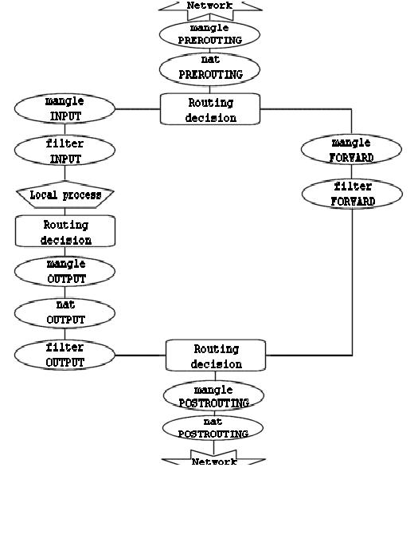

# IP Tables

IP Tables is a firewall program in Linux. This tool can be used to set rules for incoming and outgoing packets.

## Variants of IP Tables

`iptables` command was the orginal IP tables command in Linux. This tool runs in userspace and uses the kernel API of IP Tables.

With the many improvements to the orginal `iptables`, a new utility tool called `nftables` was created. The `nftables` uses a different kernel API called `nftables API`. The `nftables` can be accessed using command `nft`.

The `nftables` and `iptables` the both do the same job, however they both uses  different sytax and grammer.So the users of `iptables` cannot use `nftables` easily.

The old `iptables Kernel API` and new `nftables Kernel API` are different and the `nftables Kernel API` is very efficient compared to old `iptables Kernel API`.

Considering the above aspects, a new hybrid variant of `iptables` was developed. That's called `iptables-nft`.  The `iptables-nft` uses the `nftables Kernel API` and same syntax and grammer of `iptables`.

So there are three variants of iptables

- `iptables legacy`
- `iptables-nft`
- `nft`

## Working with `iptables` and `iptables-nft`

The `iptables` contain three types of tables. They are

- filter (default table) : it's used for packet filtering
- nat :  address translation and port changes
- mangle: used for special purposes eg: altering TTL, headers, adding marks to packets for further processing

#### 1. View the list of rules of each type of tables

```apache
    iptables -t filter -L
    iptables -t nat -L
    iptables -t mangle -L
```

#### 2. Chains of tables

All the types of tables contain some predefined chains by default. When a packet travel through the kernel, packet will pass through the chains. Rules added to the chains will be processed for the packets going through the chains.

Chains of `filter`

- INPUT
- FORWARD
- OUTPUT

Chains of `nat`

- PREROUTING
- POSTROUTING
- OUTPUT

Chains of `mangle`

- PREROUTING
- OUTPUT
- FORWARD
- INPUT
- POSTROUTING

The below diagram shows all(not all but most important) the chains of tables.



*Source: https://www.linuxtopia.org/Linux_Firewall_iptables/c951.html*

#### 3. Common Examples

##### 3.1 Isolate from the Internet

```apache
iptables -P INPUT  DROP
iptables -P OUTPUT DROP
iptables -P FORWARD DROP
```
##### 3.2 Allow Loopback communication

```apache
iptables -A INPUT -i lo -j ACCEPT
iptables -A OUTPUT -i lo -j ACCEPT
```
##### 3.3 Allow SSH over eth0

```apache
iptables -A INPUT -i eth0 -p tcp --dport 22 -j ACCEPT
iptables -A OUTPUT -i eth0 -p tcp --sport 22 -j ACCEPT
```
##### 3.4 Allow access from a subnet over eth1

```apache
iptables -A INPUT -i eth1 -s 10.1.1.0/24 -p tcp -j ACCEPT
iptables -A OUTPUT -i eth1 -s 10.1.1.0/24 -p tcp -j ACCEPT
```
##### 3.5 Allow ping/ICMP

```apache
iptables -A INPUT -p icmp --icmp-type any -j ACCEPT
iptables -A OUTPUT -p icmp --icmp-type any -j ACCEPT
```

##### 3.6 Allow ping/ICMP packets to be forwarded 

```apache
iptables -A FORWARD -p icmp --icmp-type any -j ACCEPT
```

##### 3.7 Clean IPTables

```apache
iptables -t filter -F
iptables -t filter -X

iptables -t nat -F
iptables -t nat -X
````
##### 3.8 SNAT packets coming from subnet 10.1.1.0/24 and outgoing through eth0 to 11.202.23.3

```apache
iptables -t nat -A POSTROUTING -o eth0 -s 10.1.1.0/24 -j SNAT --to-source 11.202.23.3
```
##### 3.9 Packets destined for IP 10.1.1.7 will be forwaded to 192.168.1.2 UDP,TCP

```apache
iptables -t nat -A PREROUTING -p tcp  -j DNAT --to-destination  192.168.1.2
iptables -t nat -A PREROUTING -p udp -j DNAT --to-destination 192.168.1.2
```

##### 3.10 Change SNMP port of outgoing SNMP messages

```apache
iptables -t nat -A OUTPUT -p udp --dport 162 -j DNAT --to-destination 192.168.1.33:1162
```